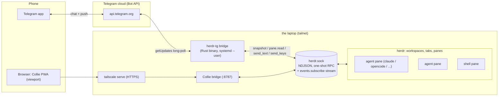
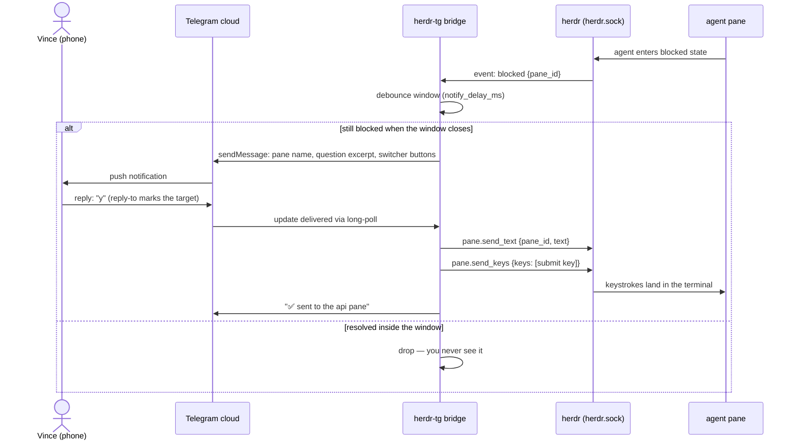
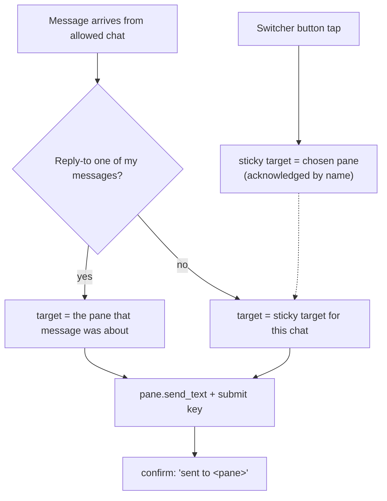
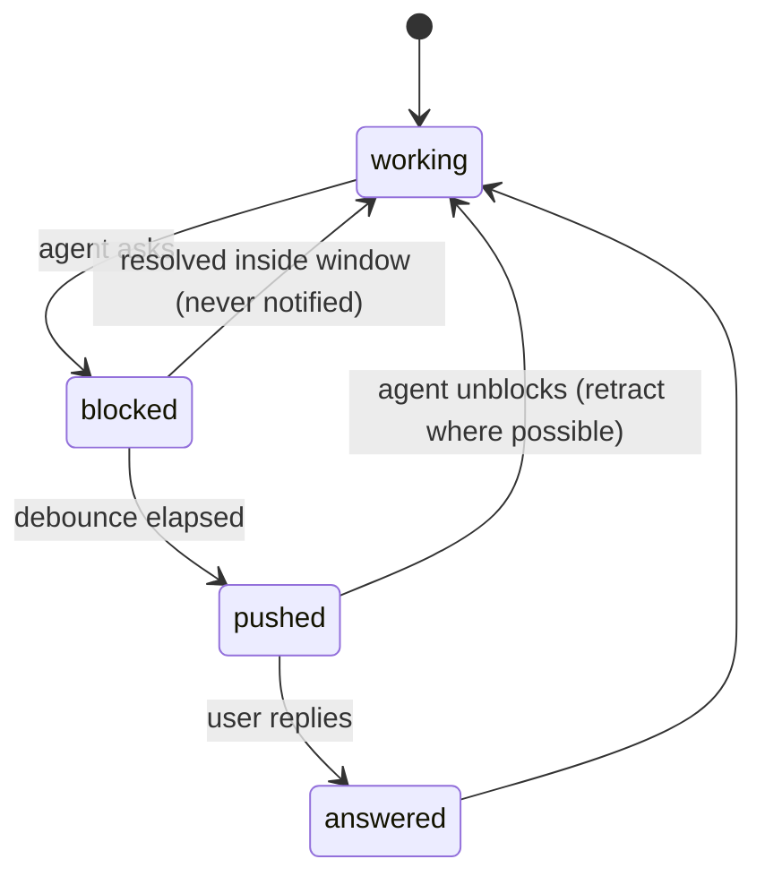

# herdr-tg — Plan (v1)

> Incubated 2026-08-28 from the brainstorm session on the laptop (context in the vault:
> `project_collie_remote_access_2026_08_28`, `project_herdr_tg`). This document is the
> single source of truth for v1 until the kickoff tracker takes over live state.

## The product, one paragraph

herdr-tg is a Telegram bot gateway over the herdr socket API: agents running in herdr panes raise
questions; herdr-tg pushes those questions to a Telegram chat as messages with inline buttons and
excerpts; the operator replies from their phone and herdr-tg types the reply into the right pane.
One bot per herdr workspace, deterministic routing, push on state transitions only. Collie (the
phone PWA over the same socket) remains installed as the drill-down viewport for the rare "I need
to *see* the pane" case. herdr-tg is a single Rust binary under a hardened systemd user unit.

## Decision log (2026-08-28, brainstorm — each was an explicit call)

| # | Decision | Rejected alternative | Why |
|---|---|---|---|
| D1 | **Rust** (tokio, serde, teloxide) | Reuse Collie's TS bridge core | herdr's socket API is NDJSON with a machine-readable schema (`herdr api schema --json`) → a thin typed client; single static binary kills the runtime-drift failure class (the bun/mise shim crash-looped Collie 279×); herdr itself is Rust; owner fluency |
| D2 | **Bot per workspace** | One bot for everything | Chat list = project list; mute per project; the bot's identity implies the workspace — no workspace disambiguation, routing stays pane-level; matches the proven per-project-bot topology on the build box |
| D3 | **v1 deterministic routing** (sticky + buttons) | LLM router from day one | The catastrophic failure of a remote-control surface is your words landing in the wrong terminal; deterministic routing can be stale but never misreads; the agent router is v2, running as a pane itself |
| D4 | **Telegram cloud accepted** (messages transit/store on Telegram's servers; bots can't be E2E) | Collie's no-cloud posture | Owner already runs the whole org via Telegram; mitigation: relay asks/digests only — never full pane dumps; approvals via buttons; agents redact secrets in asks |
| D5 | **New repo + own kickoff instance** | Build inside the existing org | Clean gates (cargo, not turbo/biome), own tracker/mission-state, own release life; shared vault memory keeps all context |
| D6 | **Dev on the laptop, pushes via explicit go / from the build box** (lap kickoff gates still red) | Fix lap gates first | Live herdr herd is on the lap (Unix socket is local-only); gate-greening is real but separate work — don't front-load it (promote later) |
| D7 | **Long-polling** for Bot API | Webhooks | NAT'd tailnet box, no public ingress needed; long-poll is fine for one-user volumes |

## Architecture

**Trust boundaries:** phone↔Telegram-cloud is Telegram's (accepted, D4); everything from the Bot
API to the panes is inside the tailnet box; the bridge binds nothing — it dials out to the Bot API
and to a local Unix socket. There is **no listening port** in herdr-tg at all. The identity gate is
the Telegram chat-id allowlist (fail-closed, per-workspace) — the equivalent of Collie's
`COLLIE_TRUSTED_USER`.

## The ask→answer round trip (the product)

## Routing (v1 — deterministic)

Rules that make it trustworthy: the current target is always visible (in the confirmations and the
switcher); switching is acknowledged by pane name; every keystroke into a pane is audit-logged
(local file, append-only) — the same posture as Collie's audit trail.

## Notification discipline (the anti-spam contract)

- Push fires on **state transitions** (blocked/done), never on output volume.
- Debounce: an ask that resolves before the window closes never notifies (Collie's
  `notifyDelayMs` behavior, re-derived).
- Quiet hours (per-workspace config): during them, asks batch into a digest delivered at the end
  of the window.
- Digests when idle: at most N pushes/hour except for explicitly-marked urgent asks.

## Failure flows (designed before 2am, not during)

| Failure | Detection | Behavior |
|---|---|---|
| Bridge dies | systemd `Restart=always` (StartLimitIntervalSec=0 — a phone-only operator can't `reset-failed`) | Auto-restart; sticky state persists on disk (atomic JSON) so routing resumes |
| herdr dies / socket gone | Connect/getUpdates errors | Bridge stays up, reconnect loop, `/status` answers "herdr unreachable"; a single recovery notice when the stream re-establishes (not one per retry) |
| Bot token revoked / API 401 | Telegram error on poll | Bridge exits non-zero; systemd restart throttles; distinct log signature — NOT a silent loop |
| Agent pane closed while it was the sticky target | snapshot diff shows pane gone | Next message answers with target picker instead of typing into a dead pane — never silently reroute |
| Sticky target pane was MOVED | `pane_moved` event | The pane_id changes and the old one stops resolving even though the agent is alive and the pane is not closed; the event carries `previous_pane_id` plus the full new `PaneInfo`, so migrate sticky state silently rather than falling back to the picker |
| Laptop asleep | (everything) | Long-poll returns on wake; missed events recovered from snapshot diff — push the asks that are still blocked, skip the ones that resolved |

## Slices (each has a falsifiable proof)

| # | Slice | Proof |
|---|---|---|
| 1 | **herdr-client crate**: connect, `ping` handshake (assert `protocol >= 20`, record version and capabilities, fail closed below the minimum), `session.snapshot`, `pane.read` (visible — [never `recent` in background](https://github.com/AltanS/collie/blob/main/HERDR_API.md), it scrolls the operator's screen), `pane.send_text` + `send_keys`, `events.subscribe` | `./scripts/proof-slice1.sh` exits 0 — seven gates: reference sanity (protocol 20), non-vacuity, sandboxed client under a stripped PATH, sandwich-diffed `herdr-tg status --json` vs `herdr api snapshot` through `scripts/normalize.jq`, `pane.read` text parity, event decode via a filtered-status replay, and the negative paths (missing socket → exit 3, protocol 19 → exit 4). NOT `herdr status`, which prints versions, not the herd. *The status diff proves `session.snapshot`; gate 4 proves `pane.read`; gate 5 proves `events.subscribe`; `pane.send_text` / `send_keys` / `send_input` are built but have **no live proof** in slice 1.* |
| 2 | **Telegram channel**: one bot (BotFather token in the `HERDR_TG_TOKEN` env var, never in a tracked file; structure in git-ignored `herdr-tg.toml`), chat-id allowlist, `/status` | You message the bot from the phone; it answers with the real herd state |
| 3 | **The product loop**: blocked/done events → debounced pushes with buttons; replies → sticky routing → send_text + submit key; switcher; ✅ confirmations | Full ask→answer round trip from the phone against a real agent pane |
| 4 | **Discipline**: quiet hours, digest batching, retraction, redaction (excerpts only, capped lines), append-only audit log | A busy build pane produces zero pushes; a blocked agent produces exactly one |
| 5 | *(v2, separate plan)* routing agent as a pane | — |

**v1 honesty notes:** ask-extraction is "last visible lines, trimmed" — not Collie-grade harness
adapters; the per-agent submit key (`Enter` vs alternatives) is a build-time verification item
per agent type; one workspace per bot means no cross-workspace routing in v1.

## Stack (locked, D1)

`tokio` + `serde`/`serde_json` (herdr NDJSON client) · `teloxide` (Bot API: long-poll, inline
keyboards) · TOML config (`herdr-tg.toml`, git-ignored: workspace name, socket path, chat
allowlist, quiet hours, pane scope — the bot **token** is not in it; it is read from
`HERDR_TG_TOKEN`, delivered by the systemd unit's `EnvironmentFile=`, so the credential never
enters the file that gets copied around. If a token ever does land in a file, name the key
`token` or `bot_token`: `scan-secrets` has no Telegram pattern and catches a secret only by
those names — as `bot`, `id` or `key` it is invisible to the scanner and a leak reaches origin)
· state = atomically-written JSON file (no database in v1 — deliberately) ·
systemd `--user` unit with Collie's hardening posture (`NoNewPrivileges`, `PrivateTmp`,
`StartLimitIntervalSec=0`) · gates: `cargo fmt --check`, `cargo clippy -D warnings`, `cargo test`
(adopted into kickoff's composed lefthook gates).

## References

- herdr socket API: `HERDR_API.md` in the Collie plugin checkout (empirically verified against
  herdr 0.7–0.8; the machine-readable schema is `herdr api schema --json`)
- Collie (viewport, stays installed): plugin `herdr.collie` on the laptop; fork
  `vinceferro/collie@personal` carries the 500ms poll patch
- Precedent topology: per-project Telegram bots on the build box (two private repos)
